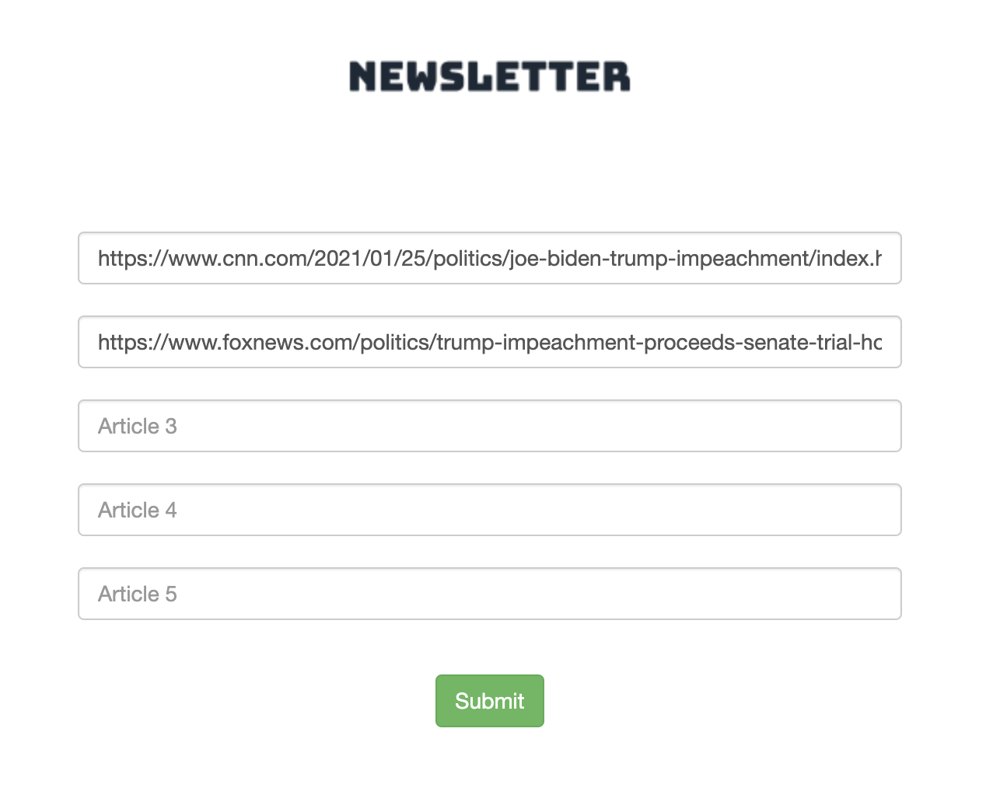
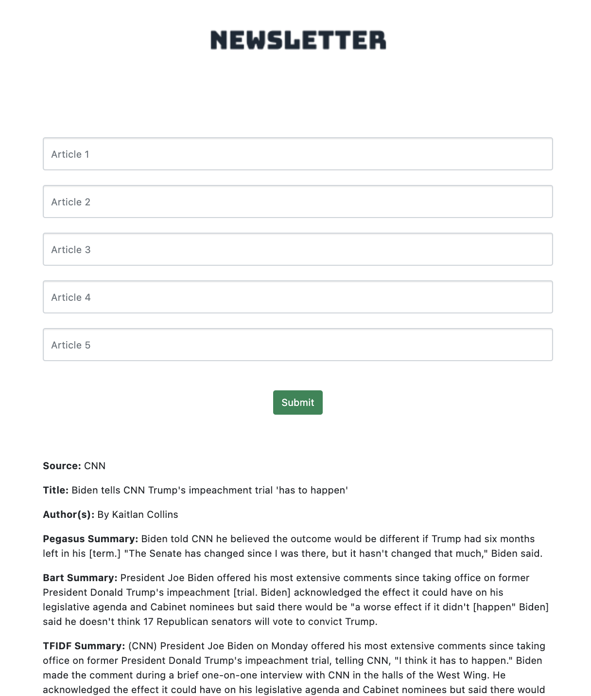

# Newsletter

Newsletter uses Machine Learning to automatically generate newsletters and blog posts by summarizing articles in an easy to use web app.

Copy and paste a links to news articles you want to summarize:

 

Newsletter will then scrape the content and use state of the art summarization algorithms and sentiment analysis to create your newsletter or blog post.

 

Example of newsletters generated from this app can be found [here](https://github.com/jweissenberger/newsletter/tree/master/example_ouput_articles).

This repo is far from perfect but it was able to create some pretty interesting articles that are entirely computer generated.

## Stack: 
- Flask
- Docker
- Gunicorn
- Nginx
- HuggingFace
- NewsPaper3k

## How to run the app:
Cloud: 
Run the bash file `start_up.sh` on an AWS EC2 instance and then access the web app over your browser.

Locally: 
Flask and Python way(quickest): Install the requirements in a new environment: `cd flask-app; pip install -r requirements.txt; python models_download.py` 
Then in `newsletter/flask-app/newsletter` run `python app.py`

Docker way: install docker and docker compose and run `docker-compose up` from the main directory

## HuggingFace
The important ML models for this repo are taken from HuggingFace's transformers library.
The models that showed the best performance were Google Pegasus and DistilBart both trained on 
the CNN-Dailymail dataset. Many other models such as T5, Pegasus trained on other datasets and 
other ML models were tested and are still available within the repo (flask-app/newsletter/hf_summarizer.py). 

More abstractive summarization models like GPT and Pegasus Multi-news were also tested but showed
poor results. They struggled to properly cite quotes and would get easily confused about facts like
who the current president is. This is likely due to the datasets that these models were trained on came from a different
time period, which would train it to learn that Obama was president for example instead of Trump or Biden.

## NewsPaper3k
Used for websraping and pulling the articles from a link

## TODO's
- Add a loading screen
- Add a celery task queue for article generation so that users don't have to have the page hang while the articles are generated
- Task queue example [here](https://blog.miguelgrinberg.com/post/using-celery-with-flask)
- Celery task queue docker compose example [here](https://nickjanetakis.com/blog/dockerize-a-flask-celery-and-redis-application-with-docker-compose)
- Set passwords and secrets from environment variables so that they're not hard coded
- Use more Bootstrap and CSS to make it cleaner

## Future improvements:
- Because the NLP models are so large its recommended that a large/GPU AWS EC2 Instance is used
so that article generation doesn't take too long. This would be expensive to leave running if you
only use it a couple times a day. Offloading the computation to an AWS Batch autoscaling group with 
a minimum size of 0 would be much more cost effective (Do scraping and kick of jobs from a small
EC2 and then use boto3 calls to the Batch cluster)
- Alternative to the above: could investigate the new container support in lambda
- NewsAPI to pull articles and find trending topics (super expensive though)
- Auto generate articles based off of trending topics (Get trending news articles and then pull 
similar articles based off of keywords)
- Use Flask-login to make user access more secure
- Store previously generated articles in a db
- Scrape newstitles daily or in the background so that users don't have to wait for updates
- release the summarization python code as a pip package
- Release the whole api to AWS Marketplace as a base image
- Accept both text and links as input

